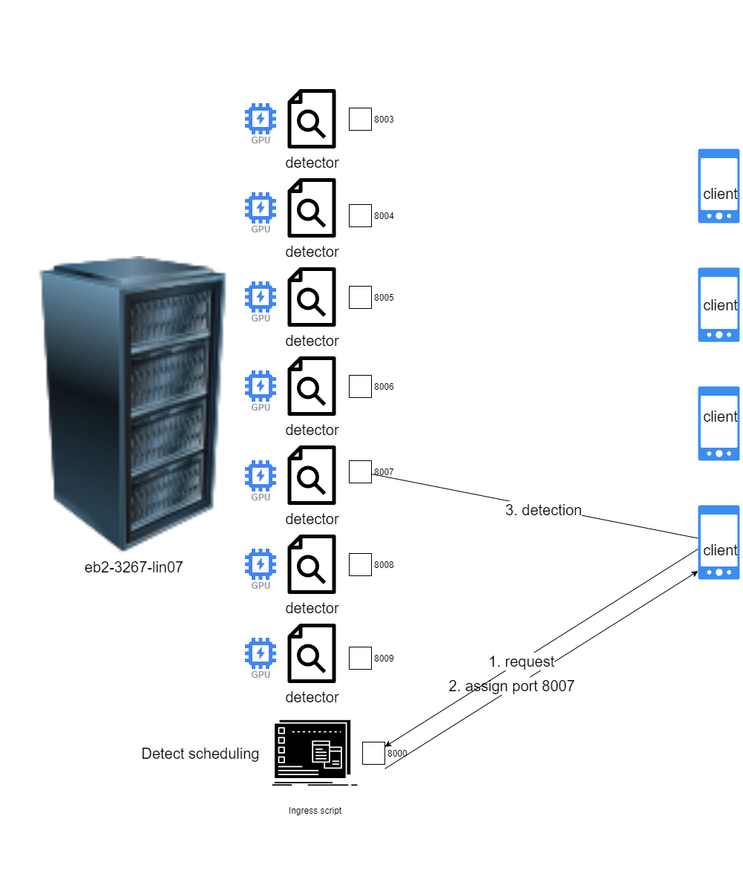
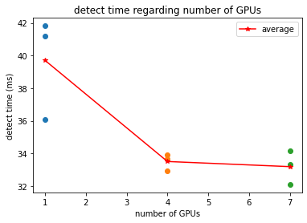

# microservices  

## System architecture
  
The server side code is in the "server_side" folder, includes both the ingress script and detector.  
The client side script is in the "client_side" folder.  
The data processing scipt is in the "data_process" folder.  

## todo list for each part
### Server
- [x] migrate from deprecated opentracing-jaeger to opentelemetry  
- [x] achieve cross-services tracing with Jaeger  
  
- [x] Change the configuration of ingress script (number of GPUs, Jaeger exporter endpoint, etc.) with http requests.  
- [ ] automated change resource assignment pattern
### Client
- [x] implement a python-based video object detection client
- [x] migrate from deprecated opentracing to opentelemetry  
- [ ] polish python-based client (more details in the client_side folder)  
### Experiment
- [ ] build a "number of GPUs-number of clients-computational time cost" model
    - [x] pre-test: investigate the general trend  
    
    - [x] small data test: average result for small amount of data  
    
    - [x] automate the data collection pipeline  
    - [ ] number of GPUs v.s. computational time cost
    - [ ] number of clients v.s. computational time cost